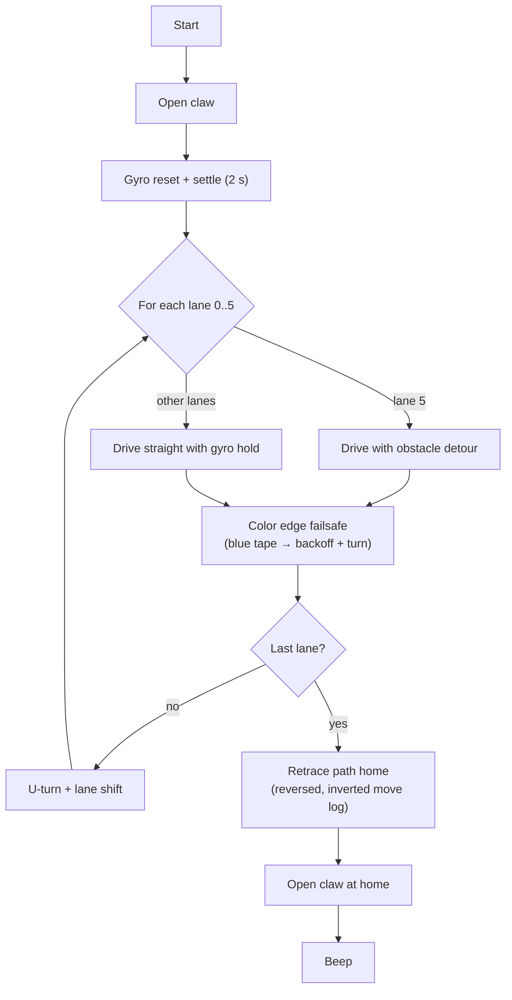

# Jarvis & Jarvis II

Autonomous rover software built for the NASA Community College Aerospace Scholars (NCAS) 2026 program. Written in Python/MicroPython for LEGO EV3 hardware via [ev3dev](https://www.ev3dev.org/) and [Pybricks](https://pybricks.com/), developed in VS Code.

Team Red Giant X outperformed all other competing teams and earned Team MVP.


*`jarvis.py` running unchanged in the included [simulator](docs/simulator.md): six-lane sweep (blue), obstacle detour, and the reverse retrace home (orange).*

---

## Background

NCAS is a NASA-sponsored program where community college students form simulated aerospace companies and compete in lunar rover missions tied to the Artemis program. The mission required a rover to navigate an arena, avoid obstacles, identify mineral samples by color, and retrieve them with a claw.

While other teams used simple straight-line programs requiring manual repositioning between runs, Jarvis navigated the full arena autonomously. Once deployed, the rover handled navigation, obstacle avoidance, and sample interaction entirely on its own with no manual intervention between runs.

---

## Documentation

| | |
|---|---|
| 📖 [**How it works**](docs/how-it-works.md) | Gyro-held driving, two-pass turns, tape detection, path recording and retrace, with diagrams |
| 🚀 [`jarvis.py` walkthrough](docs/jarvis.md) | The competition program, section by section |
| 🔺 [`jarvis_ii.py` walkthrough](docs/jarvis_ii.md) | Triangle sweep variant and its geometry |
| 🔌 [Hardware and setup](docs/hardware.md) | Port map, loading onto the EV3, pre-run checklist |
| 🎛️ [Tuning and known issues](docs/tuning.md) | Every constant explained, plus improvement ideas |
| 💃 [Demos](docs/demos.md) | Dance, donut and motor-test programs |
| 🖥️ [Simulator](docs/simulator.md) | Run the real programs on a PC, no robot needed |

---

## Hardware


- **Platform:** LEGO MINDSTORMS EV3
- **Runtime:** ev3dev + Pybricks MicroPython
- **Sensors:**
  - Gyroscope (S3): heading correction and turn accuracy
  - Color sensor (S4): blue boundary-tape detection
- **Actuators:**
  - Left drive motor (Port D)
  - Right drive motor (Port A)
  - Worm gear claw motor (Port C)

An earlier version of this hardware list also included an ultrasonic sensor for obstacle detection and claw activation. The code in this repository doesn't read one; the obstacle detour is at a fixed position. See [hardware.md](docs/hardware.md#the-robot).

---

## Programs

### `jarvis/jarvis.py`: main competition program


Full-arena rectangular sweep using a predefined coordinate system in millimeters. Key features:

- **Gyroscope-corrected straight driving:** a proportional heading hold in the control loop cancels out the chassis pulling to one side ([details](docs/how-it-works.md#1-gyro-held-straight-driving))
- **Gyroscope-based turns:** two-pass proportional control for accurate 90-degree turns ([details](docs/how-it-works.md#2-gyro-turns))
- **Obstacle zone avoidance:** automatic detour around the designated obstacle zone in lane 5, tiles 3–4 ([details](docs/jarvis.md#the-obstacle-detour))
- **Color edge detection:** debounced blue-tape detection with automatic backoff and recovery ([details](docs/how-it-works.md#3-blue-tape-edge-detection))
- **Path recording and retrace:** every move is logged so the rover can drive itself back to the start ([details](docs/how-it-works.md#4-path-recording-and-retrace-home))

### `jarvis/jarvis_ii.py`: triangle sweep variant

A sweep variant for triangular arena regions (x >= y diagonal). Works out each lane's length from the diagonal boundary, drives each lane, then retraces its path home. See [jarvis_ii.md](docs/jarvis_ii.md). That page also covers a sign issue on the westbound lanes that the simulator found.

---

## Demos

These are standalone programs used for testing and exhibition. They are not part of the competition run. Details in [docs/demos.md](docs/demos.md).

| File | Description |
|---|---|
| `demos/ymca_dance.py` | Plays YMCA while the motors pulse to the beat |
| `demos/daisy_dance.py` | 40-second Daisy Bell choreography with light effects |
| `demos/donut_field.py` | Drives a lawn-mower grid of donuts across the arena |
| `demos/motor_test.py` | Basic ev3dev2 motor sanity check |

---

## Setup

1. Flash your EV3 with [ev3dev](https://www.ev3dev.org/docs/getting-started/) and install Pybricks MicroPython.
2. Connect to the EV3 via SSH or VS Code with the [EV3 extension](https://marketplace.visualstudio.com/items?itemName=ev3dev.ev3dev-browser).
3. Copy the `jarvis/` folder to `/home/robot/` on the brick.
4. Run `jarvis.py` from the EV3 menu or via SSH.

A pre-run checklist is in [hardware.md](docs/hardware.md#before-every-run).

### Calibration

Before a run, adjust these constants at the top of `jarvis.py` to match your build (full list in [tuning.md](docs/tuning.md)):

| Constant | Default | Description |
|---|---|---|
| `WHEEL_DIAMETER_MM` | 57.0 | Measured wheel diameter |
| `AXLE_TRACK_MM` | 134 | Distance between wheel centers |
| `DRIVE_SPEED` | 300 | Forward drive speed (mm/s) |
| `SHIFT_MM` | 300 | Lane width (mm) |
| `LONG_RUN_MM` | 3600 | Arena length (mm) |

### Try it without a robot

```sh
pip install -r sim/requirements.txt
python3 sim/run.py jarvis/jarvis.py --plot jarvis.png
python3 sim/make_figures.py        # regenerate every picture in docs/images/
```

See [docs/simulator.md](docs/simulator.md).

---

## Architecture



## Repository layout

```
jarvis/
  jarvis.py        competition program (rectangle sweep + obstacle detour)
  jarvis_ii.py     triangle sweep variant
demos/             dance, donut and motor-test programs
docs/              documentation (start at docs/README.md)
  images/          figures, all generated by sim/make_figures.py
sim/
  pybricks/        fake Pybricks API for running programs on a PC
  world.py         simulated clock and robot physics
  run.py           run a program and print a summary or plot
  make_figures.py  regenerate docs/images/
```

---

## Notes

- `motor_test.py` uses the **ev3dev2** Python library, not Pybricks. It will not run in the Pybricks environment.
- WAV files referenced in the dance demos (`ymca.wav`, `daisy.wav`) are not included in this repository.
- The gyro sensor on EV3 is sensitive to vibration. Keep the robot still during the 2-second settle period at startup.

---

Built by **h4ch1net**, Team Red Giant X, NASA NCAS 2026
