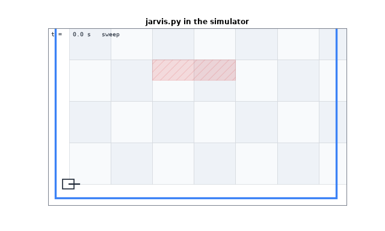
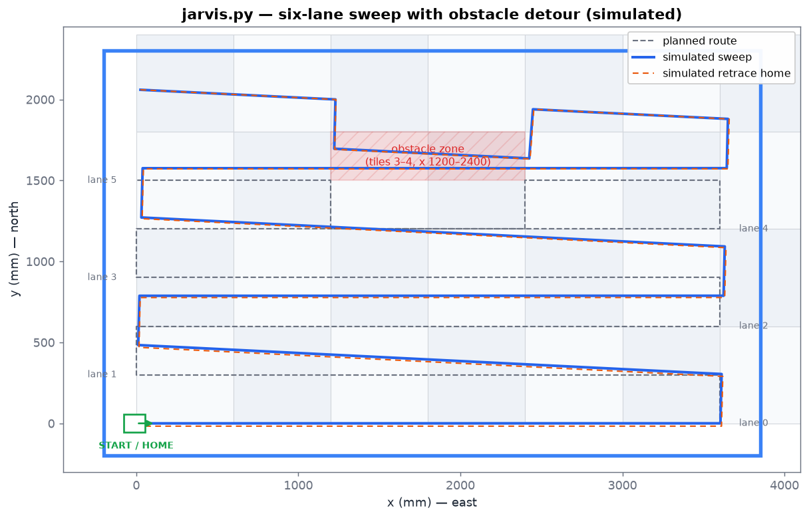
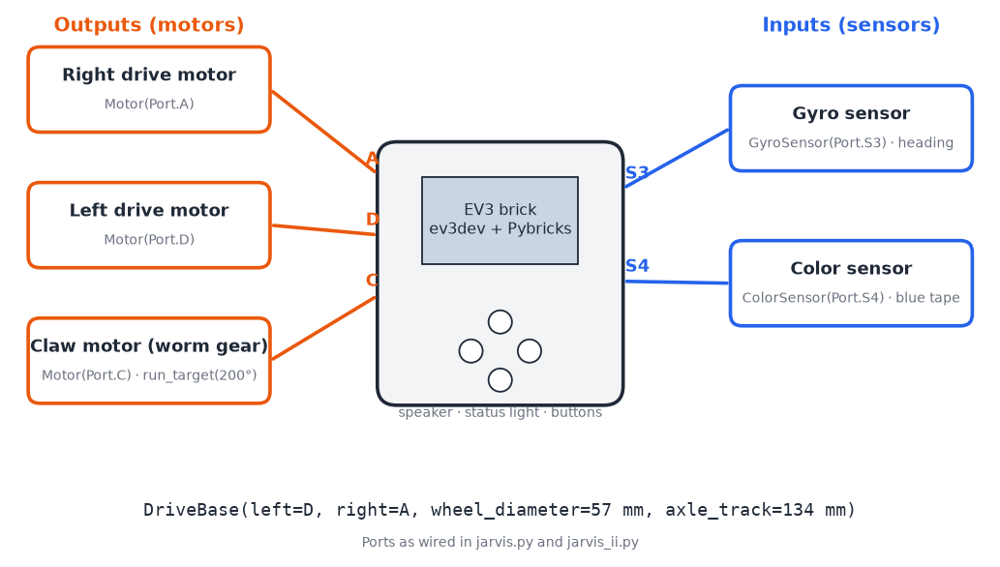
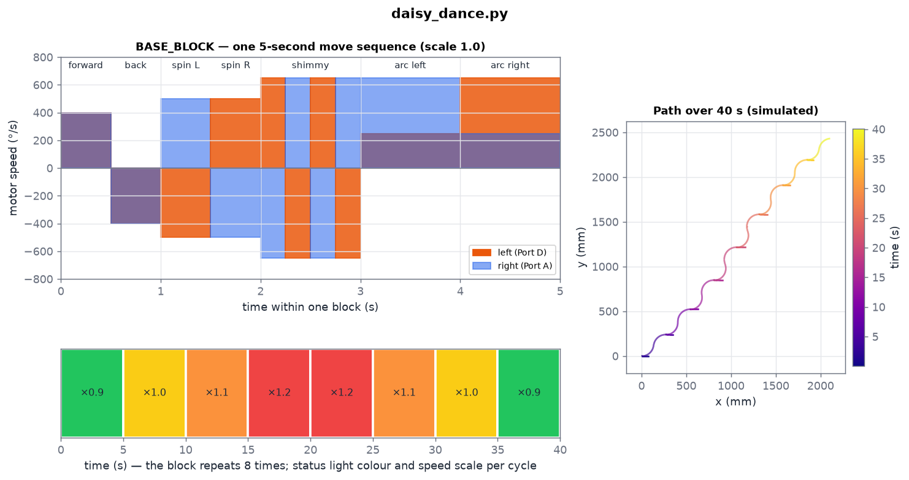
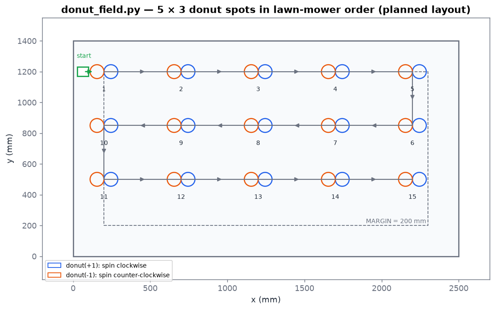
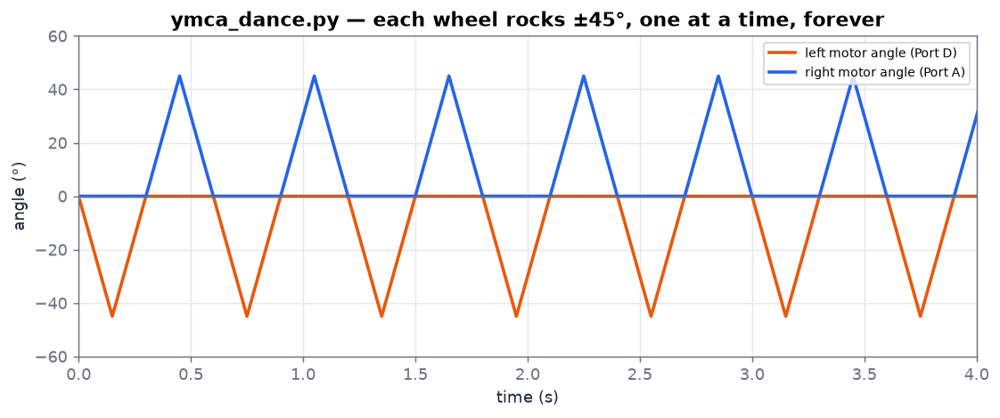

# Jarvis documentation

Start with **How it works** for the ideas shared by both programs, then read the page for the program you care about.

| Page | What's in it |
|---|---|
| [Hardware and setup](hardware.md) | Port map, sign conventions, loading programs onto the EV3, pre-run checklist, calibration |
| [How it works](how-it-works.md) | Dead reckoning, gyro-held straight driving, two-pass gyro turns, blue-tape debouncing, path recording and the reverse retrace |
| [`jarvis.py`](jarvis.md) | The competition program: six-lane sweep, obstacle detour, return home |
| [`jarvis_ii.py`](jarvis_ii.md) | Triangle sweep variant, its geometry, and a sign bug on odd lanes |
| [Demos](demos.md) | YMCA and Daisy Bell dances, donut field, ev3dev2 motor test |
| [Simulator](simulator.md) | Running the real programs on a PC, and how the pictures were made |
| [Tuning and known issues](tuning.md) | Every constant explained, known issues, ideas for improvement |

## Picture index

All images are generated by [`sim/make_figures.py`](../sim/make_figures.py) from simulated runs of the unchanged program files, except the hardware port map and the donut layout, which are diagrams.

| | |
|---|---|
|    `jarvis.py` route vs simulation |    `jarvis_ii.py` as written vs fixed |
|    Gyro turn controller |    Gyro heading hold |
|    Blue-tape failsafe |    Move log and retrace |
|    EV3 port map |    Daisy Bell choreography |
|    Donut field layout |    YMCA wheel rocking |
