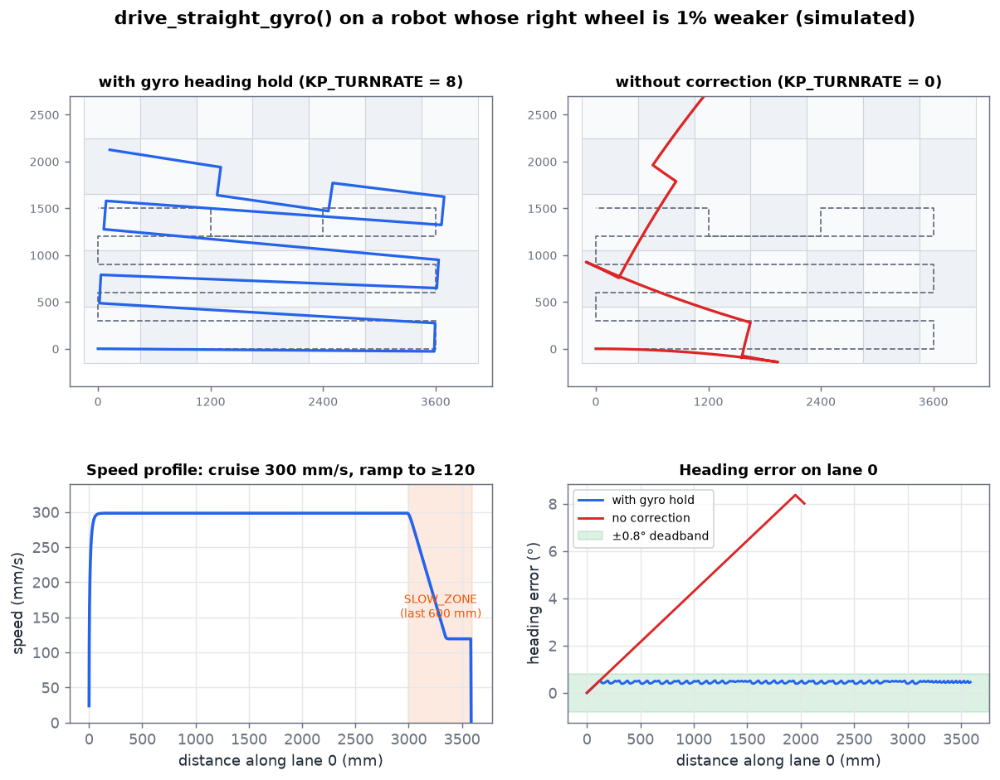
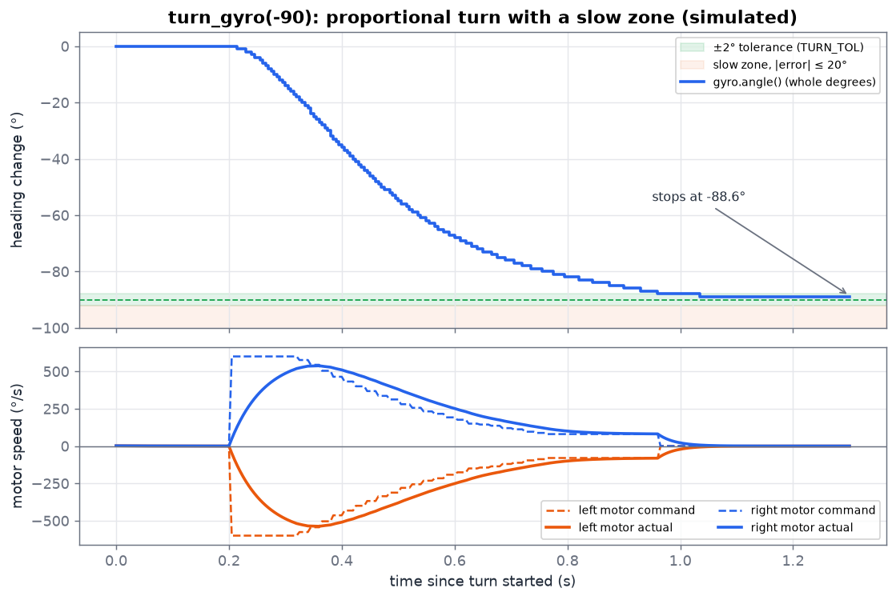
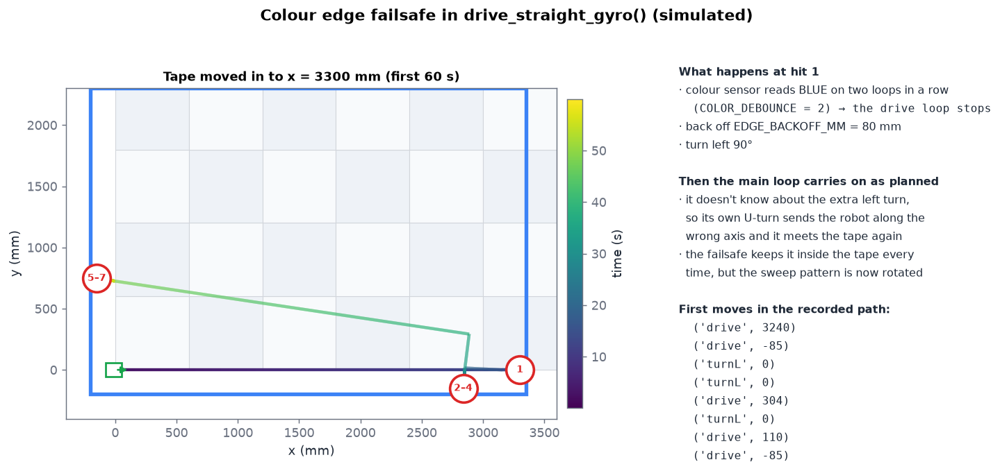
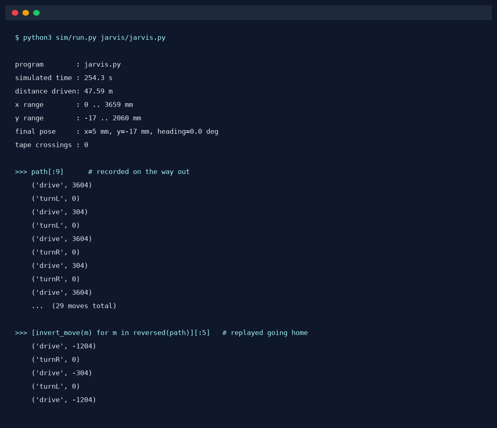

# How it works: the building blocks

[← Docs index](README.md)

`jarvis.py` and `jarvis_ii.py` are built from the same five pieces. This page explains each one. [jarvis.md](jarvis.md) and [jarvis_ii.md](jarvis_ii.md) then show how each program puts them together.

| Building block | `jarvis.py` | `jarvis_ii.py` |
|---|---|---|
| [Coordinates and dead reckoning](#coordinates) | constants at the top | constants plus [triangle geometry](jarvis_ii.md#triangle-geometry) |
| [Gyro-held straight driving](#1-gyro-held-straight-driving) | `drive_straight_gyro()` | `drive_segment()` |
| [Gyro turns](#2-gyro-turns) | `turn_gyro()` | `turn_relative()` |
| [Blue-tape edge detection](#3-blue-tape-edge-detection) | `edge_color_seen()` | `edge_color_seen()` |
| [Path recording and retrace home](#4-path-recording-and-retrace-home) | `path`, `invert_move()`, `return_home_by_retrace()` | same, with signed turns |

---

## Coordinates

Neither program uses a camera, beacons or absolute position. Jarvis uses **dead reckoning**: it knows where it is because it knows where it started and what moves it has made since. The two sensors it relies on are:

- **wheel encoders** (through `DriveBase.distance()`), for *how far*, and
- **the gyro**, for *which way*.

All field measurements are millimetres measured from the start point. With 600 mm floor tiles and 300 mm lanes, a full lane in `jarvis.py` is `LONG_RUN_MM = 3600` (six tiles).

Because there is no outside reference, small errors build up over a run. The [simulator](simulator.md) pictures show how.

---

## 1. Gyro-held straight driving

`drive_straight_gyro()` ([`jarvis/jarvis.py:143`](../jarvis/jarvis.py#L143)) drives a set distance while keeping the robot on the heading it had when the drive began.

```python
target_heading = gyro.angle()            # hold the heading we started with

while abs(robot.distance()) < target_distance:
    remaining = target_distance - abs(robot.distance())

    speed = DRIVE_SPEED                                       # 300 mm/s
    if remaining < SLOW_ZONE:                                 # last 600 mm
        speed = max(DRIVE_MIN_SPEED, int(DRIVE_SPEED * remaining / SLOW_ZONE))

    err = gyro.angle() - target_heading
    if abs(err) < HEADING_DEADBAND:                           # ignore < 0.8°
        err = 0
    turn_rate = clamp(-KP_TURNRATE * err, -MAX_TURNRATE, MAX_TURNRATE)

    robot.drive(direction * speed, turn_rate)
    ...
    wait(20)                                                  # ~50 Hz loop
```

Every 20 ms the loop does three things:

1. **Sets the speed.** It cruises at 300 mm/s. In the last 600 mm it slows down in proportion to the distance left, but never below 120 mm/s. That way it doesn't overshoot, and it doesn't crawl so slowly that it stalls.
2. **Corrects the heading.** This is a proportional controller. If the gyro shows the robot has turned `err` degrees clockwise, the loop asks for a counter-clockwise turn of `8 × err` °/s, limited to ±120 °/s. Errors under 0.8° are ignored so the robot doesn't wobble over gyro noise.
3. **Watches for the tape** (section 3).

When the distance is reached, the robot stops and brakes. If `record=True`, the distance actually driven is added to the move log.

**Why it matters:** the two drive motors are never exactly equal. Without correction, even a 1% difference curves the robot by several degrees over a 3.6 m lane:



*Simulated with a right wheel 1% weaker than the left. Left: the real code. Right: the same code with `KP_TURNRATE = 0`. The bottom-left plot shows the speed ramp in the slow zone. In the bottom-right plot, the corrected heading stays inside the 0.8° deadband for the whole lane.*

---

## 2. Gyro turns

`turn_gyro(deg)` ([`jarvis/jarvis.py:82`](../jarvis/jarvis.py#L82)) turns the robot in place by `deg` degrees (positive = right). It drives the two motors in opposite directions:

```python
gyro.reset_angle(0)          # measure this turn from zero
target = deg

# Pass 1: proportional, fast
while True:
    error = target - gyro.angle()
    if abs(error) <= TURN_TOL:                      # within 2°: done
        break
    speed = int(KP_TURN * abs(error))               # 8 °/s per degree of error
    speed = max(MIN_TURN_SPEED, min(TURN_FAST, speed))   # 80 .. 600 °/s
    if abs(error) <= TURN_SLOW_ZONE:                # last 20°
        speed = min(speed, TURN_SLOW)               # cap at 150 °/s
    # error > 0 → spin clockwise, else counter-clockwise
    ...
brake; wait(200)

# Pass 2: fine-tune, slow (max 150 °/s)
while abs(gyro.angle() - target) > TURN_TOL:
    ...
brake; wait(200)
```

- **Pass 1** spins fast while far from the target (up to 600 °/s at the motor, about 255 °/s for the robot). It slows down as the error shrinks and is capped at 150 °/s for the last 20°. The 80 °/s minimum keeps the motors from stalling just before the target.
- **Pass 2** runs after the robot has braked and settled for 200 ms. If momentum carried it past the ±2° window, or it stopped short, this pass nudges it back at low speed.



*One simulated left turn. Top: the gyro reading in whole degrees, as the EV3 reports it. Bottom: commanded (dashed) and actual (solid) motor speeds. The actual speed lags the command, which is why the slow zone exists. The fine-tune pass wasn't needed here because pass 1 already ended inside the green band.*

**One thing to know:** every turn starts with `gyro.reset_angle(0)`, so each turn is measured from wherever the robot happens to be pointing, not from the starting heading. A turn that ends 1.4° short, which is still within tolerance, stays 1.4° short. The next straight drive then holds that slightly-off heading. Over many turns these small errors add up. That's the slight tilt of the lanes in the [simulated path](jarvis.md#the-whole-run). See [tuning.md](tuning.md#ideas-for-improvement) for a way to fix it.

---

## 3. Blue-tape edge detection

The arena border is blue tape. The color sensor faces down at the front of the robot:

```python
def edge_color_seen(state):
    c = color.color()
    if c in EDGE_COLORS:              # (Color.BLUE,)
        state["edge_count"] += 1
    else:
        state["edge_count"] = 0
    return state["edge_count"] >= COLOR_DEBOUNCE   # 2 readings in a row
```

**Debouncing:** one blue reading isn't enough. It takes `COLOR_DEBOUNCE = 2` blue readings in a row (40 ms at the 20 ms loop rate) to count as an edge, so a shadow or a scuff on the floor doesn't stop the robot. The counter is stored in a `state` dict so that `drive_straight_gyro()` can check and reset it after the loop ends.

What happens next depends on the program:

| | `jarvis.py` | `jarvis_ii.py` |
|---|---|---|
| Stop driving | yes | yes |
| Back off | 80 mm (`EDGE_BACKOFF_MM`) | 150 mm |
| Then | **turns left 90°** | nothing; returns `hit_edge=True` to the caller |
| Recorded for the retrace | backoff and turn, yes | backoff, yes |



*The tape was moved in to 3300 mm in the simulator so the robot would reach it. The failsafe works: the robot never crosses the tape. But the main loop doesn't adjust its plan afterwards, so the rest of the lane pattern is off. More in [jarvis.md](jarvis.md#5-the-edge-failsafe-in-practice).*

---

## 4. Path recording and retrace home

Every move made with `record=True` is added to a list:

```python
path.append(("drive", direction * actual))   # signed mm actually driven
path.append(("turnL", 0))                    # or ("turnR", 0)
```

Drives record **the distance actually driven** (`robot.distance()` after stopping), not the distance that was asked for. If a drive is cut short by the tape, the log still matches what really happened.

To get home, the program walks the list **backwards** and **inverts** each move:

```python
def invert_move(move):
    kind, val = move
    if kind == "drive":  return ("drive", -val)     # forwards ↔ backwards
    if kind == "turnL":  return ("turnR", 0)        # left ↔ right
    if kind == "turnR":  return ("turnL", 0)
```



*The move log from a simulated `jarvis.py` run, and the first moves of its inverted replay.*

Inverting a drive gives a negative distance, so **the robot reverses the whole route home** without turning around. Each lane is backed down under the same gyro heading hold. In the simulator the robot ends within about 2 cm of where it started, because turn errors cancel out: a turn that stopped 1.4° short on the way out is reversed by an opposite turn on the way back.

The retrace runs with `check_edge=False`, so the tape is **not** checked on the way home. The robot trusts the log.
