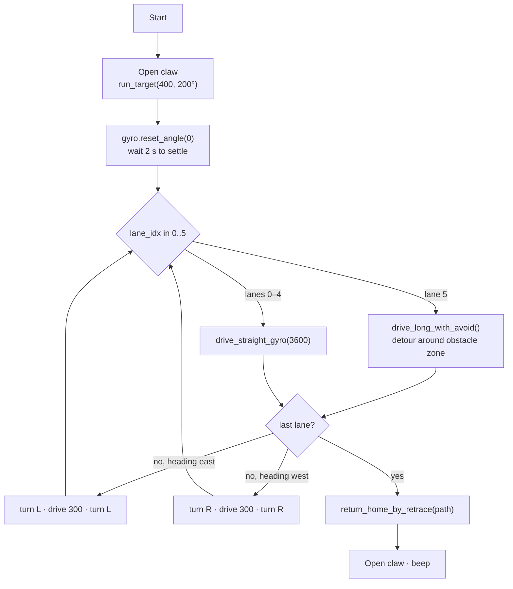

# `jarvis.py`: the competition program

[← Docs index](README.md) · source: [`jarvis/jarvis.py`](../jarvis/jarvis.py)

`jarvis.py` sweeps a 3.6 m × 1.5 m area in six back-and-forth lanes, like mowing a lawn. It steers around a known obstacle zone in the last lane, then backs along its own path to the start. Once placed on the field it needs no help.


*`jarvis.py` running unchanged in the [simulator](simulator.md): sweep in blue, retrace home in orange.*

## The whole run


The dashed grey line is the route the code is designed to drive. The blue line is what the simulated robot drove, and the dashed orange line is its trip home. The two differ because of the heading build-up explained in [how-it-works.md](how-it-works.md#2-gyro-turns). Even so, the robot finishes back at the start: in the simulator it ends 5 mm east and 17 mm south of where it began, facing the same way.



## Walkthrough

### 1. Constants (lines 9–46)

The top of the file holds every number you might tune, grouped by purpose: field size, obstacle zone, robot geometry, drive tuning, turn tuning, color detection and claw. [tuning.md](tuning.md) lists them all.

The field layout comes from three of them:

```python
LONG_RUN_MM = 3600     # lane length (6 tiles × 600 mm)
SHIFT_MM    = 300      # spacing between lanes
AREA_X_MM   = 1800     # total width to cover → 1800 // 300 = 6 lanes
```

### 2. Hardware setup (lines 48–62)

Creates the brick, three motors, two sensors and the `DriveBase`. See [hardware.md](hardware.md).

### 3. Startup (lines 246–252)

```python
state = {"edge_count": 0}

claw_motor.run_target(CLAW_SPEED, CLAW_OPEN_ANGLE, then=Stop.HOLD)
wait(200)

gyro.reset_angle(0)
wait(2000)
```

The claw moves to 200°, which is open, and holds there so it can't flop shut. The gyro is zeroed and then left alone for 2 s, because an EV3 gyro that is read while still settling can drift.

### 4. The main loop (lines 254–276)

```python
lanes = int(AREA_X_MM // SHIFT_MM)  # 6 lanes (0..5)
path = []
travel_dir = 1  # +1 = east, -1 = west

for lane_idx in range(lanes):
    if lane_idx == AVOID_LANE_INDEX:
        drive_long_with_avoid(travel_dir, state, path)
    else:
        drive_straight_gyro(LONG_RUN_MM, state, path=path, record=True, check_edge=True)

    if lane_idx == lanes - 1:
        break

    if travel_dir == 1:      # at the east end: turn up and come back west
        turn L; drive SHIFT_MM; turn L
        travel_dir = -1
    else:                    # at the west end: turn up and go east again
        turn R; drive SHIFT_MM; turn R
        travel_dir = 1
```

After each lane the robot does a "U-turn": turn, move over one lane, turn again. Turning left at the east end and right at the west end means each new lane is 300 mm further north. `travel_dir` tracks which way the robot is facing, which the detour code needs.

#### The obstacle detour

Lane 5 (y = 1500 mm, heading west) has an obstacle zone between x = 1200 and 2400 mm, described in the code as *"top-half of tiles 3 and 4"*. `drive_long_with_avoid()` ([line 235](../jarvis/jarvis.py#L235)) splits the lane into five legs:

```python
drive_straight_gyro(AVOID_X_START_MM)      # 1200 mm up to the zone
detour_down(travel_dir)                    # turn, side-step 300 mm, turn back
drive_straight_gyro(AVOID_X_LEN_MM)        # 1200 mm alongside the zone
detour_up(travel_dir)                      # turn, side-step back, turn back
drive_straight_gyro(remaining)             # 3600 − 2400 = 1200 mm to the end
```

"Down" means toward the lanes already swept (south), so during the detour the robot runs along lane 4 for 1200 mm. `detour_down` / `detour_up` check `travel_dir` to pick left or right turns, so the same functions work whichever way the robot is heading.

The zone's position is fixed in the code, not detected. For a different field layout, change `AVOID_LANE_INDEX`, `AVOID_X_START_MM` and `AVOID_X_LEN_MM`.

### 5. The edge failsafe in practice

Every recorded drive passes `check_edge=True`. If the color sensor sees blue tape twice in a row, `drive_straight_gyro()` stops, backs off 80 mm and turns left. See [how-it-works.md](how-it-works.md#3-blue-tape-edge-detection).

This keeps the robot inside the field, but **the main loop isn't told it happened**. It goes on with its planned U-turn, which now starts from a heading 90° off:


When the field is laid out as the constants expect, the tape is never reached and this doesn't matter. It does mean the failsafe works as an emergency stop, not as a way to recover the sweep. [tuning.md](tuning.md#ideas-for-improvement) has a suggestion.

### 6. Going home and finishing (lines 278–283)

```python
return_home_by_retrace(path, state)

claw_motor.run_target(CLAW_SPEED, CLAW_OPEN_ANGLE, then=Stop.HOLD)
wait(300)

ev3.speaker.beep()
```

The recorded `path` (29 moves in a normal run) is replayed backwards with each move inverted. The robot reverses the whole route. Then the claw is moved to its open position again and the brick beeps to say it's done. See [how-it-works.md](how-it-works.md#4-path-recording-and-retrace-home).

## Numbers from a simulated run

| | |
|---|---|
| Moves recorded | 29 (15 drives, 14 turns) |
| Distance out | ≈ 23.7 m (6 × 3.6 m lanes + 5 × 0.3 m shifts + 0.6 m of detour side-steps) |
| Distance total (with retrace) | ≈ 47.6 m |
| Simulated duration | ≈ 254 s |
| Final position vs start | 5 mm, −17 mm, heading 0.0° |

The simulator models motor lag but not wheel slip, battery sag or carpet, so treat its timing as approximate. See [simulator.md](simulator.md#what-it-does-and-doesnt-model).
