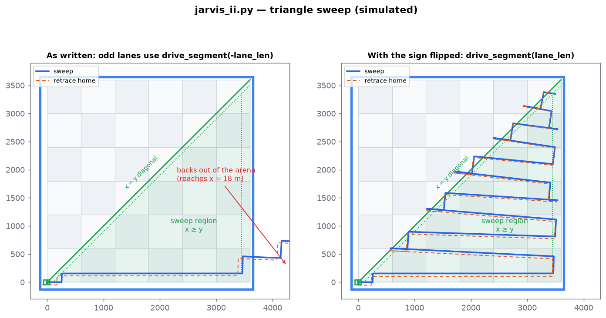

# `jarvis_ii.py`: triangle sweep variant

[← Docs index](README.md) · source: [`jarvis/jarvis_ii.py`](../jarvis/jarvis_ii.py)

`jarvis_ii.py` sweeps a **triangle** instead of a rectangle: the half of a 3.6 m × 3.6 m field below the diagonal from the bottom-left corner to the top-right corner (the region where x ≥ y). Each lane is shorter than the one before it, so the program works out every lane's length from the geometry instead of using a fixed `LONG_RUN_MM`.

It uses the same building blocks as `jarvis.py` (see [how-it-works.md](how-it-works.md)), with a few changes:

| | `jarvis.py` | `jarvis_ii.py` |
|---|---|---|
| Straight drive function | `drive_straight_gyro()` | `drive_segment()`, which also **returns** `(distance, hit_edge)` |
| Turn function | `turn_gyro()` | `turn_relative()`, plus `turn_180()` |
| How turns are logged | `("turnL", 0)` / `("turnR", 0)` | `("turn", deg)`, inverted by flipping the sign |
| Cruise speed | 300 mm/s | 250 mm/s |
| Edge reaction | back off 80 mm, turn left | back off 150 mm only |
| Lane length | fixed 3600 mm | from `x_max() - x_min_for_y(y)` |

## Triangle geometry

```python
TILE_MM = 600; GRID_TILES = 6
SIDE_MM = TILE_MM * GRID_TILES   # 3600
BUFFER_MM = 150                  # stay this far from the outer tape
DIAG_BUFFER_MM = 100             # stay this far from the diagonal

def x_min_for_y(y_mm):           # left end of a lane at height y
    return max(BUFFER_MM, y_mm + DIAG_BUFFER_MM)

def x_max():                     # right end of every lane
    return SIDE_MM - BUFFER_MM   # 3450

def can_have_lane(y_mm):
    return (x_max() - x_min_for_y(y_mm)) > 0
```

At height `y`, a lane runs from 100 mm right of the diagonal (`x = y + 100`) to 150 mm inside the right-hand tape (`x = 3450`). Lanes start at `y = 150` and step up by `SHIFT_MM = 300`, so there are 11 lanes, from 3200 mm long at the bottom down to 200 mm at the top (y = 3150).

## Program flow

1. **Startup:** open the claw, zero the gyro, wait 2 s (same as `jarvis.py`).
2. **Reach the first lane:** the robot starts in the bottom-left corner facing +x. It drives `start_x = 250` mm, turns left, drives `start_y = 150` mm, then turns right. It's now at the left end of lane 0.
3. **Sweep loop:**
   - **Even lanes** go east (`drive_segment(lane_len)`). At the right end it turns left, moves up 300 mm and turns left again, so it now faces west.
   - **Odd lanes** go west, ending near the diagonal. To reach the next lane's start, which is 300 mm further right *and* 300 mm higher because the diagonal moves, it does a staircase step: `turn 180 → drive 300 → turn left → drive 300 → turn right`.
   - The loop ends when the next lane wouldn't fit.
4. **Retrace home** using the same reverse-and-invert method as `jarvis.py`. Turns are stored as signed degrees, so inverting one just flips its sign.
5. Open claw, beep.

## Simulated result, and a sign bug on odd lanes



The simulator shows a problem on the **odd (westbound) lanes**. Line 277 is:

```python
drive_segment(-lane_len, state, path=path, record=True, check_edge=True)
```

After the two left turns at the end of an even lane, the robot already **faces west**. A negative distance makes `drive_segment()` drive **backwards**, so the robot reverses east, out past the right-hand tape (left panel). The color sensor is on the front, so it reaches the tape late. The 150 mm backoff that follows is also a negative drive, which pushes the robot further out.

Change it to a positive distance (one character):

```python
drive_segment(lane_len, state, path=path, record=True, check_edge=True)
```

With that change (right panel), the staircase step at the end of each odd lane lines up exactly. The robot finishes an odd lane at `x_min_for_y(y_next)` facing west, and `turn 180 → +300 x → +300 y` takes it to `x_min_for_y(y_next + 300)`, the start of the next even lane. That's strong evidence that a positive distance was what the author intended.

**This repository's code is unchanged.** The right panel was made by applying the fix only inside the simulator (`sim/make_figures.py` passes it as a `patches=` argument). Try it on the real robot before committing the change.

## Simulated run with the fix

| | |
|---|---|
| Lanes | 11 (y = 150 … 3150 mm) |
| Moves recorded | 55 (28 drives, 27 turns) |
| Distance total (with retrace) | ≈ 48 m |
| Simulated duration | ≈ 366 s |
| Final position vs start | within ~6 cm |
