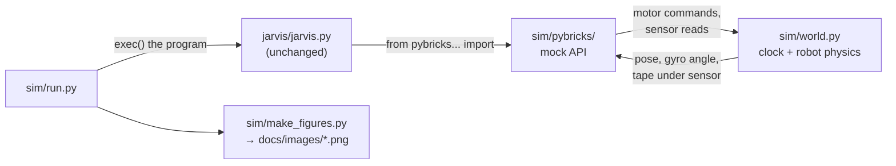

# The simulator (`sim/`)

[← Docs index](README.md)

The pictures in these docs were made by running the **real program files**, unchanged, on a computer. The `sim/` folder contains a small fake version of the Pybricks API (motors, gyro, color sensor, `DriveBase`, `wait()`) backed by a 2-D physics model of the robot. When `jarvis.py` calls `gyro.angle()` or `robot.drive()`, it talks to the simulated robot instead.

This lets you see what the code does, try a tuning change, or test a fix without an EV3.

## Quick start

```sh
pip install -r sim/requirements.txt         # matplotlib, numpy, pillow (only needed for plots)

python3 sim/run.py jarvis/jarvis.py         # text summary
python3 sim/run.py jarvis/jarvis.py --plot out.png
python3 sim/run.py jarvis/jarvis.py --drift 0.98          # 2% weaker right wheel
python3 sim/run.py jarvis/jarvis.py --tape -150 -150 3300 2400   # tape around this rectangle

python3 sim/make_figures.py                 # regenerate every image in docs/images/
```

Example output:

```
program        : jarvis.py
simulated time : 254.3 s
distance driven: 47.59 m
x range        : 0 .. 3659 mm
y range        : -17 .. 2060 mm
final pose     : x=5 mm, y=-17 mm, heading=0.0 deg
tape crossings : 0
```

`run.py` itself only needs the Python standard library. matplotlib is only needed for `--plot` and `make_figures.py`.

## How it fits together



| File | Role |
|---|---|
| `sim/world.py` | The simulated world: a clock, the robot's x/y/heading, motor states, the blue tape, and logs of everything that happens. |
| `sim/pybricks/` | Stand-ins for `pybricks.hubs`, `.ev3devices`, `.parameters`, `.robotics` and `.tools`, with the same names and arguments as the real library. |
| `sim/run.py` | Loads a program file, applies optional source patches, runs it and prints a summary. `run_program()` can also be imported from your own scripts. |
| `sim/make_figures.py` | Builds every image in `docs/images/`. |

### Simulated time

Nothing really waits. `wait(ms)` moves the simulated clock forward and updates the physics in 5 ms steps. A 4-minute run takes well under a second. Programs that loop forever (like `ymca_dance.py`) are stopped with `time_limit_ms=`.

### Trying a change without editing the program

`run_program()` takes `patches=[(old_text, new_text), ...]`, which is applied to the source in memory before running:

```python
import sys; sys.path.insert(0, "sim")
from run import run_program, summary

w = run_program("jarvis/jarvis.py",
                patches=[("KP_TURNRATE = 8.0", "KP_TURNRATE = 4.0")],
                right_wheel_scale=0.98)
print(summary(w))
print(w.globals["path"][:5])        # the program's own variables are available
```

This is how the "without correction" panel and the `jarvis_ii.py` sign-fix panel were made.

## What it does and doesn't model

**Modelled:**

- Differential-drive kinematics using the program's wheel diameter and axle track.
- Motor response lag: actual speed follows the command with a 60 ms time constant, or 30 ms when braking. This is why turns end slightly short of the target and why the slow zones matter.
- Motor top speed (about 1000 °/s).
- The gyro reporting whole degrees, clockwise positive, as on the EV3.
- A color sensor 70 mm in front of the wheel axle that reads BLUE over a 50 mm tape band.
- Optional uneven wheels (`right_wheel_scale`) and gyro drift (`gyro_drift_dps`).

**Not modelled:** wheel slip, carpet or tile friction, battery voltage, robot mass and inertia beyond the motor lag, sensor noise, the claw's effect on anything, and audio. The fake `DriveBase.straight()` / `.turn()` are simple ramps, not the real Pybricks controllers.

**Treat the results as a picture of the program's logic,** such as the route, the order of moves, what happens on a tape hit, and whether the retrace gets home. The sim hasn't been checked against the real robot, so don't use it to predict exact times or millimetres.

## Coordinates used in the plots

- Origin = where the robot's wheel axle centre starts.
- +x = the direction the robot first faces (east). +y = to its left (north).
- Heading is in degrees clockwise from +x, the same convention as the EV3 gyro.
